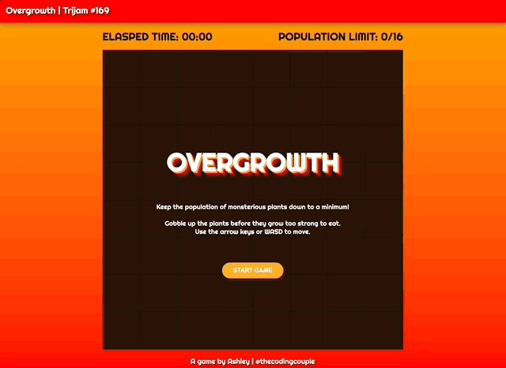

# trijam-169
Source code for Ashley's Trijam #169 entry. The theme is "Overpopulation."

[Trijam](https://itch.io/jam/trijam-169) is a weekly game jam where the goal is to create a game in under 3 hours of development time.

Total Dev Time: ~8 hours.

## Synopsis 

Overgrowth is a grid based game where players are trying to keep the population of monsterious plants under control by consuming them.  Don't let the plants grow too large or they'll become impossible to eat and block your path as you try to access the other plants.

Use arrow keys or WASD to move the player.



## Built With

* Visual Studio Code

## Third Party Assets

* [Mega Game Music Collection](https://www.gamedevmarket.net/asset/mega-game-music-collection/)
    * Energy Rock Track #3 (looped).wav
* Mega SFX Pack
    * Hit_Hurt3.wav
    * Jump18.wav
    * human_attack_2.wav
* [Righteous Google Font](https://fonts.google.com/specimen/Righteous)
* [Moment.js](https://momentjs.com/)

## Project Setup

Run with local web server

```bash
python -m http.server 8000
```

or

```bash
python3 -m http.server 8000
```

## Maintainers

* [Ashley Grenon - @townsean](https://github.com/townsean)

## License (MIT)

MIT License

Copyright (c) 2022 Ashley Grenon

Permission is hereby granted, free of charge, to any person obtaining a copy of this software and associated documentation files (the "Software"), to deal in the Software without restriction, including without limitation the rights to use, copy, modify, merge, publish, distribute, sublicense, and/or sell copies of the Software, and to permit persons to whom the Software is furnished to do so, subject to the following conditions:

The above copyright notice and this permission notice shall be included in all copies or substantial portions of the Software.

THE SOFTWARE IS PROVIDED "AS IS", WITHOUT WARRANTY OF ANY KIND, EXPRESS OR IMPLIED, INCLUDING BUT NOT LIMITED TO THE WARRANTIES OF MERCHANTABILITY, FITNESS FOR A PARTICULAR PURPOSE AND NONINFRINGEMENT. IN NO EVENT SHALL THE AUTHORS OR COPYRIGHT HOLDERS BE LIABLE FOR ANY CLAIM, DAMAGES OR OTHER LIABILITY, WHETHER IN AN ACTION OF CONTRACT, TORT OR OTHERWISE, ARISING FROM, OUT OF OR IN CONNECTION WITH THE SOFTWARE OR THE USE OR OTHER DEALINGS IN THE SOFTWARE.
